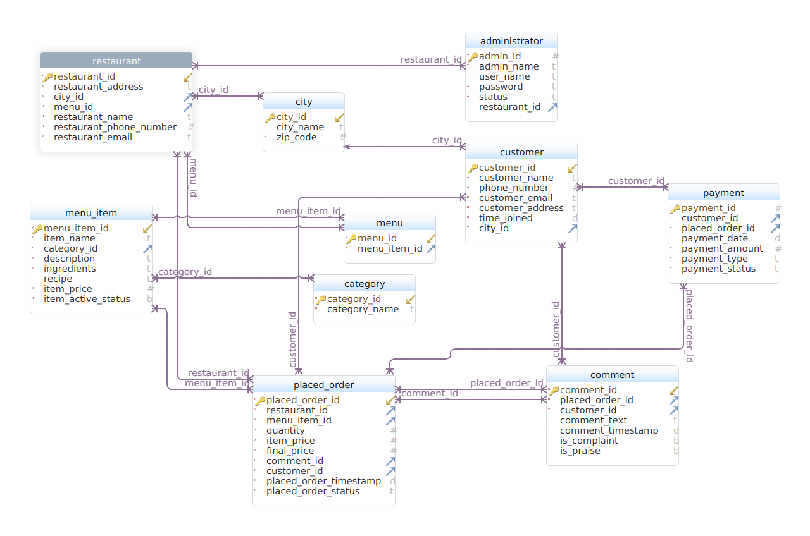

## foodelivery
A food ordering monolith in Go

## DB Schema

## API Documentation

1. /api/v1/auth
2. /api/v1/orders
3. /api/v1/menu
4. /api/v1/restaurants
5. /api/v1/city
6. /api/v1/customers
7. /api/v1/pricing (offers can be applied on the total price)
8. /api/v1/cart
9. /api/v1/payment
10. /api/v1/delivery

### Order endpoints `/api/v1/auth/`

| method | route            | description          | data                                                    |
| ------ | ---------------- | -------------------- | --------------------------------------------------------|
| POST   | /signup          | Register a user      |  `{email, password, address, name}`                     |
| POST   | /login           | Login a user         | `{email, password}`                                     |

 

### Admin endpoints `/api/v1/orders`

| method | route             | description                  | data                                                    |
| ------ | ------------------|------------------------------|---------------------------------------------------------|
| GET    | /orders           | Get all orders               |                                                         |
| POST   | /orders           | Place an order for food      | `{userid, orders[]`                                      |
| GET    | /orders/users/:id | Get the order history(user)  | `{id}`                                                  |
| GET    | /orders/:id       | Get a specific order         | `{id}`                                                  |
| PUT    | /orders/:id       | Update the status of an order| `{id}`                                                  |

    
### Users endpoints `/api/v1/menu`

| method | route           | description                   | data                                                   |
| ------ | ----------------|-------------------------------| -------------------------------------------------------|
| GET    | /menu           | Get available menu            |                                                        |
| POST   | /menu           | Add a meal option to the menu | `{name, category, price, quantity, price}`             |

